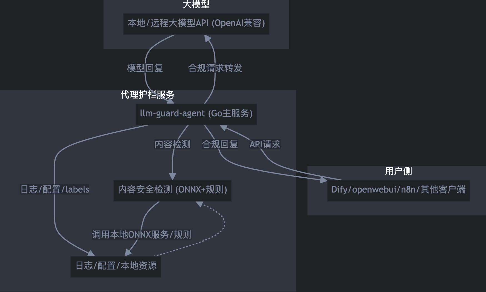
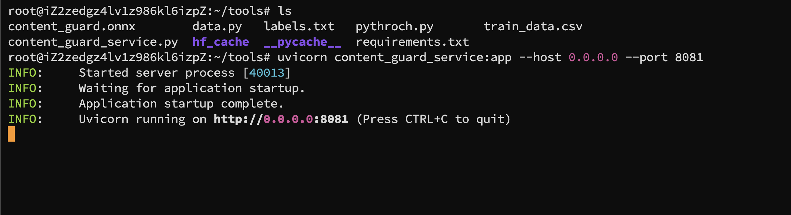
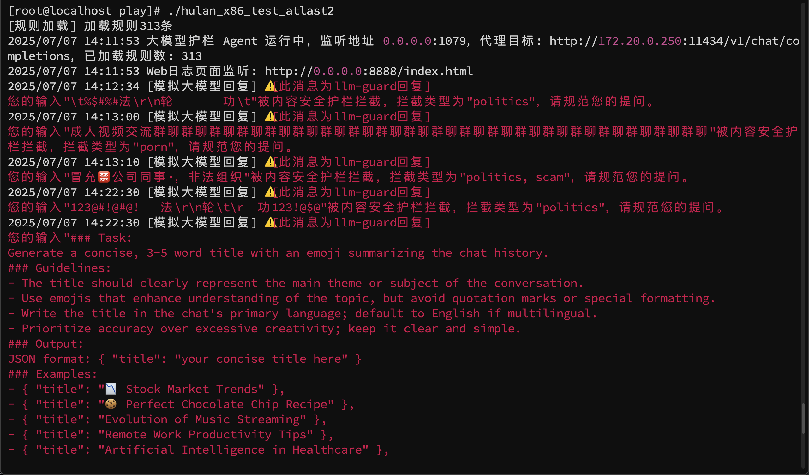
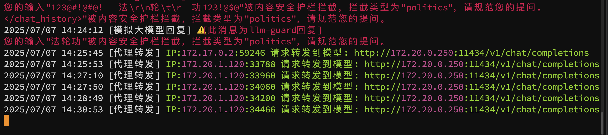
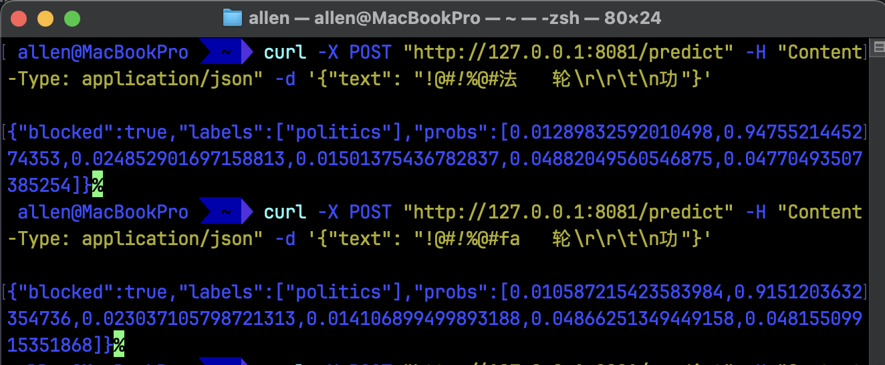
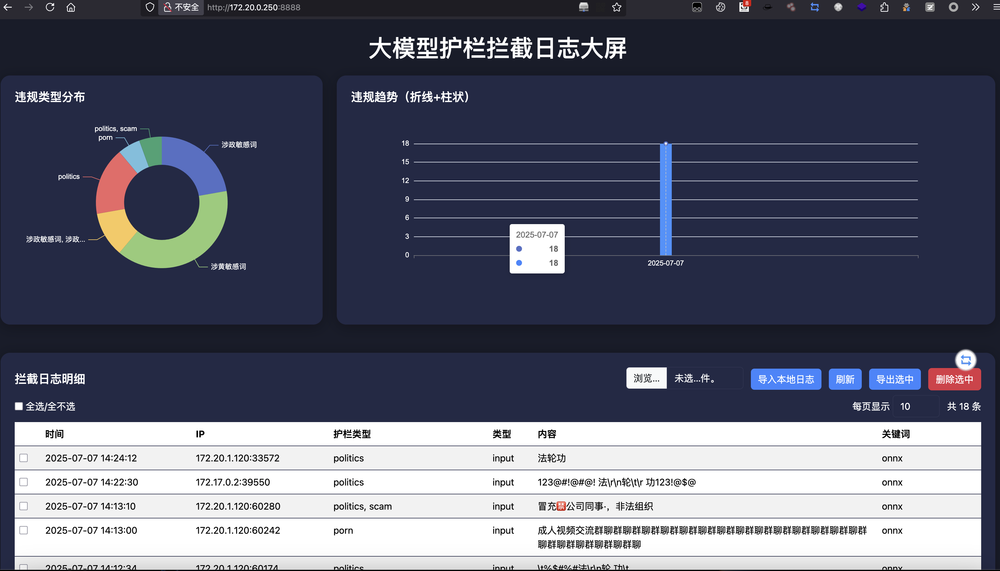

# llm-guard-agent 离线部署与使用手册

## 目录

- [项目简介](#项目简介)
- [功能特性](#功能特性)
- [目录结构](#目录结构)
- [环境准备](#环境准备)
- [依赖离线安装](#依赖离线安装)
- [数据生成与模型训练](#数据生成与模型训练)
- [ONNX推理服务部署](#onnx推理服务部署)
- [Go代理服务部署](#go代理服务部署)
- [配置文件说明](#配置文件说明)
- [常见问题与排查](#常见问题与排查)

---

## 项目简介

`llm-guard-agent` 是一个支持多平台（如 Dify、openwebui、n8n 等）的 LLM 内容安全代理，具备 ONNX 推理规则模型、YAML规则兜底、详细日志、灵活配置等特性，适合企业/内网环境离线部署。



## 功能特性

- 输入/输出/文件名多模态内容安全拦截，支持自定义拦截提示
- ONNX多标签文本分类模型推理，YAML规则兜底
- Dify/openwebui/n8n等平台兼容，支持流式SSE
- 日志记录、主机名、IP、拦截类型等全量追踪
- 支持大规模数据增强与自定义训练
- 全流程离线部署，无需外网

## 目录结构

```
llm-guard-agent/
├── config/                				# 配置文件目录
│   └── config.yaml       			  # 主配置文件
|   └── rules.yaml         				# 用户自行添加的兜底规则(具有行业针对性的违规词等)
├── database/              				# 数据与Python服务
│   ├── data.py            				# 训练数据生成脚本
│   ├── pythroch.py        				# PyTorch训练与ONNX导出
│   ├── content_guard_service.py 	# ONNX推理服务
│   ├── content_guard.onnx 				# 导出的ONNX模型
│   ├── labels.txt         				# 标签顺序文件
│   └── train_data.csv     				# 训练数据
├── internal/              				# Go后端核心代码
├── cmd/                   				# Go主程序入口
├── logs/                  				# 日志目录
├── README.md              				# 使用手册
└── ...
```

## 环境准备

### Python

- 推荐 Python 3.9/3.10/3.11（>=3.8，建议用Miniconda/Anaconda）
- 需提前准备 transformers、torch、onnxruntime、fastapi、uvicorn、scikit-learn、pandas 等依赖

### Go

- 推荐 Go 1.18 及以上

### 离线依赖包准备

1. 在有网机器上：

   ```bash
   pip download -d offline_pkgs torch transformers onnxruntime fastapi uvicorn scikit-learn pandas
   ```

2. 拷贝 `offline_pkgs/` 到服务器，安装：

   ```bash
   pip install --no-index --find-links=offline_pkgs torch transformers onnxruntime fastapi uvicorn scikit-learn pandas
   ```

## 数据生成与模型训练

1. 生成训练数据和标签顺序：

   ```bash
   cd database
   python3 data.py
   # 生成 train_data.csv 和 labels.txt
   ```

2. 训练并导出ONNX模型：

   ```bash
   python3 pythroch.py
   # 生成 content_guard.onnx
   ```

## ONNX推理服务部署

1. 启动服务：

   ```bash
   cd database
   uvicorn content_guard_service:app --host 0.0.0.0 --port 8081
   ```

2. config.yaml 关键配置：

   ```yaml
   onnx_url: "http://127.0.0.1:8081/predict"
   ```

3. 服务接口：

   - POST `/predict`，参数：`{"text": "待检测文本"}`
   - 返回：`{"blocked": true/false, "labels": [...], "probs": [...]}`

## Go代理服务部署

1. 配置 config.yaml：

   ```yaml
   model_url: "http://你的大模型服务/v1/chat/completions"
   ...
   ```

2. 编译并启动 Go 服务：

   ```bash
   cd cmd
   go build -o llm-guard-agent main.go
   ./llm-guard-agent
   ```

3. 日志、拦截、平台适配等详见 config.yaml 说明

## 配置文件说明（config/config.yaml）

| 字段            | 说明                             |
| --------------- | -------------------------------- |
| Listen          | Go代理监听端口                   |
| WebListen       | 日志大屏web端口                  |
| onnx_url        | Python ONNX推理服务HTTP地址      |
| onnx_model_path | ONNX模型文件路径（Python服务用） |
| bert_model_name | BERT分词器/模型本地路径          |
| model_url       | 大模型API地址                    |
| model_name      | 大模型名称                       |
| api_key         | OpenAI API Key（如需）           |
| rules_file      | YAML规则文件路径                 |
| platform        | 适配平台（dify/openwebui/n8n等） |

部署+使用效果

---

## 部署与使用效果

### 1. 一站式部署流程

- **Python ONNX推理服务**：

  ```bash
  cd database
  uvicorn content_guard_service:app --host 0.0.0.0 --port 8081
  # 服务启动后，Go端即可通过 onnx_url 调用
  ```

  

  

  

- **Go代理服务**：

  ```bash
  cd cmd
  go build -o llm-guard-agent main.go
  ./llm-guard-agent
  # 日志、拦截、平台适配等详见 config.yaml
  ```





### 2. 拦截与放行效果

- **敏感内容拦截**：
  - 输入/输出/文件名命中敏感内容时，返回自定义警告提示，支持 Dify/openwebui 等平台格式。
  - 日志自动记录拦截类型、内容、主机名、IP。
  - 支持流式SSE拦截提示，Dify前端可直接展示。

- **正常内容放行**：
  - 未命中敏感内容时，自动转发到大模型API，返回原始模型回复。

### 3. API调用示例

- **POST /predict**（Python服务）

  ```json
  { "text": "法轮功是什么" }
  # 返回：{"blocked": true, "labels": ["politics"], "probs": [...]}
  ```

  

  

- **/v1/chat/completions**（Go代理）

  - 支持 OpenAI/Dify/openwebui 标准格式，拦截时返回：

    ```json
    {
      "id": "chatcmpl-guarded",
      "object": "chat.completion",
      "choices": [{
        "message": {"role": "assistant", "content": "⚠️[此消息为llm-guard回复]..."},
        ...
      }],
      "text": "⚠️[此消息为llm-guard回复]..."
    }
    ```

### 4. 日志与大屏效果

- 日志自动写入 logs/ 目录，支持 Web 大屏实时查看、检索、批量删除。

- 前端大屏支持多维度分析、趋势图、类型分布等。

  

  

### 5. 常见用法

- **自定义拦截提示**：可在代码或配置中自定义警告内容。
- **多平台适配**：通过 platform 字段切换 Dify/openwebui/n8n 等兼容逻辑。
- **规则热更新**：修改 rules.yaml 后重启服务即可生效。

---

## 常见问题与排查

- **Python服务被Killed**：内存不足，减小N、减少增强、分批写入。
- **transformers离线加载失败**：本地目录下需有 vocab.txt、config.json、tokenizer_config.json、special_tokens_map.json 等文件。
- **Go端无法访问Python服务**：检查 onnx_url 配置、端口防火墙、服务是否启动。
- **大模型API异常**：检查 model_url、api_key、目标服务可用性。
- **YAML规则未生效**：检查 rules_file 路径、文件内容格式。
- **平台兼容问题**：platform 字段需与实际前端平台匹配。

---

如有更多问题，欢迎提issue或联系开发者！

